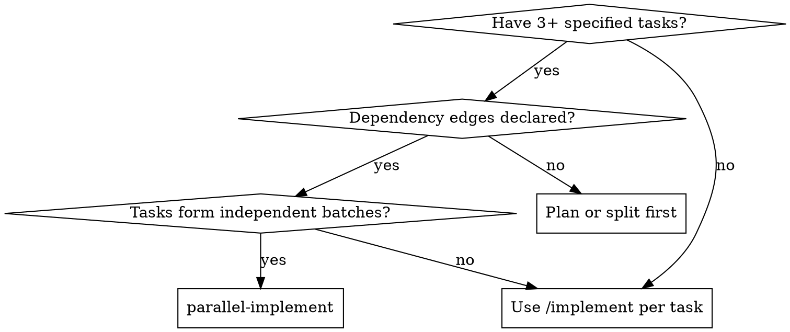

# Parallel Implement

## Overview

Orchestrate parallel implementation of many already-specified tasks that have dependency edges between them. The conductor turns the tasks into a DAG, dispatches independent batches concurrently, and verifies the integrated result before committing.

This skill does not plan, decompose, or invent dependencies. It only schedules and dispatches.

## When to Use

- **Use when** there are 3+ tasks whose dependencies form a DAG.
- **Use when** the tasks can be grouped into independent batches.
- **Use when** the spec is already detailed and each task has acceptance criteria.

**Do not use for:**
- A single task.
- A serial chain with no parallelism opportunity.
- Tasks that are not yet specified (plan first).
- Tasks that edit the same files in the same batch (merge or re-split first).

## Core Pattern

**DAG → batches → concurrent implementers → verify → reviewer → commit → whole-effort review.**

The conductor is the only git writer and the only source-file updater. Implementers edit the shared tree but never commit. Reviewers inspect the diff but never edit.

## Subagent Roles

This skill uses two subagent roles:

- **Implementer** — executes one task in a batch. Uses `./implementer-prompt.md`. Dispatched with a model tier matched to the task's mechanical / standard / judgment nature.
- **Reviewer** — reviews the integrated diff of a batch or of the whole effort. Uses `./reviewer-prompt.md`. Always dispatched with the most capable reasoning model because it requires cross-task judgment and integration sense.

## Quick Reference

| Phase | Conductor action | Tool / Artifact                      |
|---|---|--------------------------------------|
| Input | Read tasks + dependency edges from source | plan / spec / tickets / PRD          |
| DAG | Build DAG, topologically sort into batches | mental / scratch                     |
| Batch | Capture batch base SHA, check invariants | git                                  |
| Dispatch | Fire all implementers concurrently | `task` with `run_in_background=true` |
| Triage | Wait for whole batch, classify statuses | —                                    |
| Verify | Typecheck + full suite on integrated tree | project tooling                      |
| Gate | Dispatch reviewer subagent (complex only) | `./reviewer-prompt.md`               |
| Source | Mark completed tasks in input file if applicable | Edit                                 |
| Commit | Commit batch as one unit | git                                  |
| Integrate | Dispatch reviewer against original base + final suite | `./reviewer-prompt.md` + tooling     |

## The Process

### 1. Input check

Every task must have:
- Scope
- Dependencies
- Acceptance criteria

If any are missing, ask the user. If dependency edges are missing or ambiguous, ask; do not invent them.

### 2. Build the DAG

Read the tasks and edges. An edge `A → B` means B needs A's output. Topologically sort into batches of mutually independent tasks. Batch N+1 depends on batch N; batches never depend in reverse.

### 3. Per batch

For each batch, in dependency order:

1. **Capture the batch base SHA** before any dispatch.
2. **Check parallel-safety invariants.** Abort the batch if any fail.
3. **Dispatch all implementers concurrently** using the host's sub-agent dispatch tool with parallel execution enabled. Fill `./implementer-prompt.md` for each task.
4. **Wait for the whole batch.** Do not act on individual statuses until all implementers have returned.
5. **Triage implementer statuses:**
   - `DONE` → advance to verify.
   - `DONE_WITH_CONCERNS` → advance, but flag concerns for the reviewer.
   - `BLOCKED` → classify by signal:
     - **Context-shaped** ("I need to know X") → re-dispatch alone with context after batch.
     - **Capability-shaped** ("I see the algorithm but couldn't execute") → re-dispatch alone with a more capable model after batch.
     - **Plan-shaped** (task is incoherent or contradictory) → escalate to user.
   - `NEEDS_CONTEXT` → re-dispatch alone with requested context after batch.

   Re-dispatch never happens mid-batch; it always happens after the whole batch returns.

6. **Verify:** run the project's typecheck and full test suite on the integrated tree.
   - Red inside an implementer's scope → re-dispatch that implementer (max 3 retries).
   - Red outside any scope matching a planned later task → record as known gap.
   - Red outside any scope with no planned task → escalate.
7. **Gate (complex only):** dispatch a reviewer subagent using `./reviewer-prompt.md` against the batch base. If it returns `NEEDS_FIXES`, re-dispatch the offending implementers (or a new fix-up implementer if the issue crosses task boundaries), then repeat from verify. After three failed gates on the same task, escalate.
8. **Update source:** if the input is a file the user maintains, mark completed tasks with evidence.
9. **Commit:** one commit per batch.

**Batch abort / rollback.** If retries exhaust or the user declines to extend the plan, roll back to the batch base with `git reset --hard <batch-base>` and `git clean -fd` (confirm the clean first). Record the failure. Continue with the next independent batch or stop.

### 4. Model Selection

**Implementer:** use the least powerful model that can handle the task.
- Mechanical (single file, clear spec, isolated function) → fast, cheap model.
- Standard (multi-file coordination, integration, pattern matching) → standard model.
- Judgment (architecture, broad codebase, security- or state-sensitive) → most capable model.

**Reviewer:** always dispatch with the most capable reasoning model. Review is a cross-task judgment task.

**Escalation signal:** if an implementer returns `BLOCKED` with a capability-shaped blockage, re-dispatch one tier up.

### 5. Parallel-Safety Invariants

Check before every dispatch:

- **Exclusive ownership.** No two implementers in a batch edit the same file.
- **Read-only shared deps.** An implementer may read shared modules but never write outside its own scope.
- **Single git writer.** Implementers edit the tree but do not commit and do not write to the input source. The conductor is the only writer to git and the only source updater.
- **Reviewers are read-only.** Reviewers inspect the diff; they do not edit files or commit.

### 6. Complex vs Simple

- **Complex** — multi-subsystem, new behavior, security- or state-sensitive, or touches a seam others depend on. Reviewer gate runs.
- **Simple** — single subsystem, mechanical changes, no integration risk. Skip the reviewer gate; per-task implementer self-review is enough.

### 7. Integrate

After the last accepted batch:

- Dispatch a reviewer subagent using `./reviewer-prompt.md` against the **original base** (SHA before batch 1) — the whole-effort review.
- If the reviewer returns `NEEDS_FIXES`, re-dispatch the offending implementers (or a new fix-up implementer if the issue crosses task boundaries), then repeat verify → reviewer until approved.
- Run the full test suite and typecheck once more.

## Prompt Templates

- `./implementer-prompt.md` — Dispatch an implementer subagent.
- `./reviewer-prompt.md` — Dispatch a reviewer subagent for the batch gate or whole-effort review.

## Common Mistakes

| Mistake | Why it fails | Fix |
|---|---|---|
| Planning or decomposing inside the skill | This skill schedules; it does not design | Ask the user for a plan first |
| Two implementers in one batch edit the same file | Violates exclusive ownership | Merge or re-split before dispatch |
| Skipping verify after a batch | Commits broken integration | Always run typecheck + full suite |
| Committing before verify + reviewer gate | Half-broken batches land | Commit is the last step |
| Letting implementers commit | Git race | Conductor is the only committer |
| Inventing a fix-up task for an unplanned gap | Unauthorized scope expansion | Escalate to user |
| Re-dispatching mid-batch | Violates parallel-safety invariants | Wait for the whole batch |
| Running the full suite inside an implementer | Unreliable signal in parallel | Implementers run scoped tests only; conductor runs the full suite |
| Accepting `DONE` without verify | Claim is not evidence | Verify before commit |
| Dispatching reviewer on simple work | Wastes the most capable model | Skip gate for simple batches |
