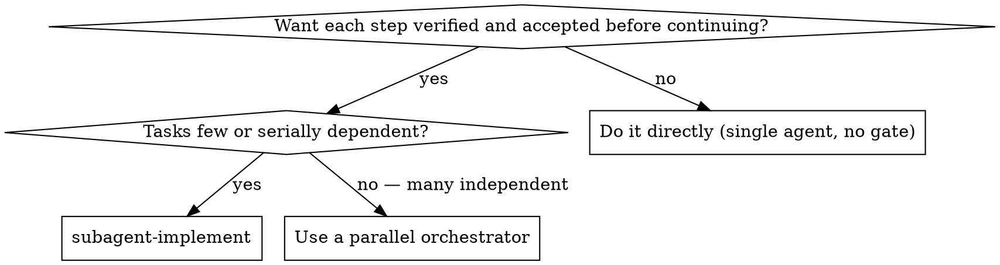

# Subagent Implement

## Overview

Implement a run of already-specified tasks **serially**, one at a time. Each task is delegated to an implementer subagent that does the work (tests first where possible, scoped typechecking, self-review); the main agent verifies and accepts each step before committing it and moving to the next. A final whole-effort review closes the work.

This skill does **not** schedule, order, decompose, or invent dependencies. The task list and its order already exist — in context, or in a file the user points to. The source can be anything: a spec, a tickets file, a todo list, a markdown checklist. This skill treats them all the same.

## When to Use

- **Use when** the task list is already specified (in context or a file) and you want each unit verified and accepted before continuing.
- **Use when** tasks are few or serially dependent — no parallelism to exploit.

**Do not use for:**
- A single unit of work with no acceptance gate wanted → do it directly.
- Many independent tasks that could run at once → use a parallel orchestrator.
- A task list that does not yet exist → produce one first; this skill will not.

## Core Pattern

**Next task → dispatch implementer → triage → single-step verify → complexity gate → accept → commit → mark done → repeat → whole-effort review.**

The main agent is the only git writer, the only task-marker, and the only verifier. Implementers edit the shared tree but never commit and never mark a task done. Reviewers inspect a diff but never edit.

## Roles

Two subagent roles, both dispatched with the host's sub-agent tool:

- **Implementer** — executes one task. Uses `./implementer-prompt.md`. Dispatched with a model tier matched to the task's mechanical / standard / judgment nature.
- **Reviewer** — reviews a single task's diff (complex gate) or the whole accumulated diff (final review). Uses `./reviewer-prompt.md`. Always dispatched with the most capable reasoning model, because review is a judgment task.

## Quick Reference

| Phase | Main-agent action | Tool / Artifact |
|---|---|---|
| Input | Read task list + order from context or the given file | spec / tickets / todo list |
| Pre-dispatch | Capture this step's base SHA | git |
| Dispatch | Fire one implementer subagent | `./implementer-prompt.md` |
| Triage | Classify implementer status | — |
| Verify | Typecheck + tests touching this step's scope on the working tree | project tooling |
| Gate | If complex, dispatch reviewer against this step's base | `./reviewer-prompt.md` |
| Accept | Accept the step | — |
| Mark | Mark the task done in the source list | Edit / task tool |
| Commit | Commit the accepted step as one unit | git |
| Final | Full suite + typecheck + reviewer against original base | `./reviewer-prompt.md` + tooling |

## The Process

### 1. Input check

The task list and its order come from context or a file the user specifies. Whatever the source, every task must have:

- Scope (what files / behavior it touches)
- Acceptance criteria

If the list is not already broken into tasks, or the order is not established, **stop and ask the user** — do not decompose or order yourself.

### 2. Per task

For each task, in the source's order:

1. **Capture this step's base SHA** before dispatch (`git rev-parse HEAD`). This is the diff base for single-step verify and, if complex, the reviewer.
2. **Dispatch one implementer** using `./implementer-prompt.md`, filled for this task.
3. **Triage the implementer's status:**
   - `DONE` → advance to verify.
   - `DONE_WITH_CONCERNS` → advance to verify; if the step is complex, forward the concerns to the reviewer.
   - `NEEDS_CONTEXT` → supply the requested context and re-dispatch alone.
   - `BLOCKED` → classify by signal:
     - **Context-shaped** ("I need to know X") → provide context, re-dispatch.
     - **Capability-shaped** ("I see the approach but couldn't execute") → re-dispatch one model tier up.
     - **Plan-shaped** (task is incoherent or contradictory) → **escalate to the user immediately; do not retry.**

4. **Single-step verify** — check only **this step's diff** (base SHA → working tree): typecheck plus the tests that touch this step's scope. Use the implementer's **change manifest** (from its `DONE` report) to identify those tests and the files in scope. Previous steps are already committed and marked done; they are a trusted base, not re-verified here.
   - Red inside this step's scope → re-dispatch the implementer (subject to the retry cap).
   - Red in an already-accepted earlier step → record as a regression and decide whether to fix now or flag.
   - Red with no task in scope → escalate.

5. **Complexity gate** — classify this step (see §4). Default to complex when ambiguous.
   - **Simple** → the main agent does a lightweight diff review (trust the implementer's two-axis self-review + passing verify) and accepts.
   - **Complex** → dispatch a reviewer subagent using `./reviewer-prompt.md` against this step's base. If it returns `NEEDS_FIXES`, re-dispatch the implementer with the findings, then repeat from verify.

6. **Mark the task done** in the source list, using that list's convention (flip a `- [ ]` checkbox, or update the harness task tool). Only the main agent marks — and only after a step is accepted.

7. **Commit** — one commit per accepted step.

**Stop and escalate** when retries exhaust (see §5) or when a plan-shaped block surfaces. Because steps are serial, a stuck step blocks every step after it — do not skip ahead.

### 3. Model Selection

**Implementer:** use the least powerful model that can handle the task.
- Mechanical (single file, clear spec, isolated function) → fast, cheap model.
- Standard (multi-file coordination, integration, pattern matching) → standard model.
- Judgment (architecture, broad codebase, security- or state-sensitive) → most capable model.

**Reviewer:** always dispatch with the most capable reasoning model.

**Escalation signal:** if an implementer returns `BLOCKED` with a capability-shaped blockage, re-dispatch one tier up.

### 4. Complex vs Simple

- **Complex** — multi-subsystem, new behavior, security- or state-sensitive, or touches a seam other steps depend on. Reviewer gate runs.
- **Simple** — single subsystem, mechanical change, no integration risk. Skip the reviewer gate; the implementer's self-review plus the main agent's diff skim is enough.
- **Ambiguous → complex.** Over-reviewing is cheaper than the failure it prevents.

### 5. Retry Caps and Escalation

- Implementer re-dispatches per step (verify red or `NEEDS_FIXES`): **max 3**.
- Reviewer-gate failures per step: **max 3**.
- On exhaustion: **stop, report the failing step and its status, and ask the user** before continuing. Serial dependency means a stuck step blocks the rest; do not skip it.
- Plan-shaped `BLOCKED` (incoherent or contradictory task): escalate immediately, no retry.

### 6. Invariants

- **Single git writer.** Implementers edit the tree but do not commit. The main agent is the only committer.
- **Single task-marker.** Implementers do not edit the task source and do not mark tasks done. The main agent marks, only after a step is accepted and verified.
- **Scoped implementers.** An implementer reads what it needs but writes only within its task's scope.
- **Reviewers are read-only.** Reviewers inspect a diff; they do not edit files or commit.

### 7. Whole-Effort Review (always runs)

After the last step is accepted:

1. Run the full test suite and typecheck once more on the final tree.
2. Dispatch a reviewer subagent using `./reviewer-prompt.md` against the **original base** (the SHA before step 1) as a whole-effort review. This is the one place cross-step integration gets seen — single-step reviews cannot.
3. If the reviewer returns `NEEDS_FIXES`, re-dispatch the implementer of the offending step (or a new fix-up implementer if the issue crosses step boundaries), then repeat verify → review until approved.

This final review is **not** complexity-gated. It always runs.

## Prompt Templates

- `./implementer-prompt.md` — Dispatch an implementer subagent for one task.
- `./reviewer-prompt.md` — Dispatch a reviewer subagent for a single-step gate or the whole-effort review.

## Common Mistakes

| Mistake | Why it fails | Fix |
|---|---|---|
| Decomposing or ordering tasks inside the skill | This skill executes a list; it does not build one | Ask the user for the list and order first |
| Re-verifying earlier steps each cycle | Wasted work; accepted steps are a trusted base | Verify only this step's diff against its base SHA |
| Running the full suite per step | Expensive and unnecessary between trusted commits | Full suite runs at the whole-effort review |
| Committing before verify + gate | Half-broken steps land | Commit is the last step of each cycle |
| Letting an implementer commit or mark done | Blurs the acceptance gate | Main agent is the only committer and marker |
| Skipping the whole-effort review | Cross-step integration goes unseen | It always runs, regardless of complexity |
| Accepting `DONE` without verify | Claim is not evidence | Verify every step before commit |
| Dispatching a reviewer on a simple step | Wastes the most capable model | Skip the gate for simple steps; default to complex only when ambiguous |
| Inventing a fix-up task for an unplanned gap | Unauthorized scope expansion | Escalate to the user |
| Skipping a stuck step to keep moving | Serial dependency — later steps build on a broken base | Stop and escalate |
