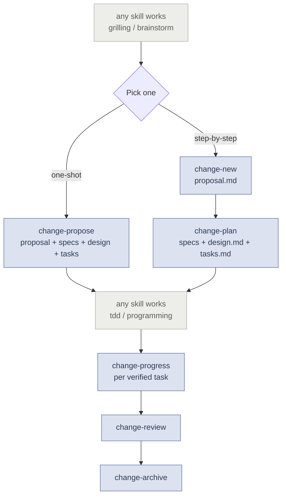

# OpenSpec

**Spec-driven change management through the full lifecycle.** Powered by the [OpenSpec CLI](https://github.com/fission-ai/openspec), these skills enforce proposal, planning, implementation tracking, review, and archival — with oracle review at every planning stage.

> [!NOTE]
> These skills wrap the `openspec` CLI for artifact management but replace its AI behavior with our own methodology — context extraction, subagent review, and disciplined progress tracking.

## Prerequisites

- **OpenSpec CLI** — install globally:

  ```bash
  npm install -g @fission-ai/openspec@latest
  ```

  Also works with `pnpm`, `yarn`, `bun`, and `nix`. See the [full installation guide](https://github.com/Fission-AI/OpenSpec/blob/main/docs/installation.md).

  No project initialization is required — `openspec new change` bootstraps the `openspec/` directory on first use. These skills replace OpenSpec's built-in agent instructions with our own methodology, so you do not need to run `openspec init`.

## Why These Skills Exist

Coding agents are powerful but undisciplined. They jump straight to code, skip planning, lose track of what's done, and produce changes that don't match the original intent. These skills enforce a structured workflow:

| Problem | How These Skills Fix It |
|---|---|
| **Agent skips planning, writes bad code** | `change-propose` (or `change-new` → `change-plan` step-by-step) forces the agent to write a proposal, specs, and design *before* implementing — with oracle review at each stage. |
| **Agent loses track of progress mid-implementation** | `change-progress` provides checkbox-level task tracking in `tasks.md` — never mark a task you haven't verified. |
| **Implementation drifts from the intended data flow or process** | `change-plan` requires tasks to preserve **flow coherence**: task order must match data/control flow, and hand-offs between tasks must be explicit. The artifacts reviewer checks this explicitly. |
| **No way to know if implementation matches the plan** | `change-review` dispatches a dedicated code reviewer subagent to inspect the diff against all artifacts, then runs `openspec validate`. |
| **Completed changes pile up without cleanup** | `change-archive` moves finished changes to `archive/` and syncs delta specs to main. `change-review` is recommended before archiving, but not enforced. |

## Workflow



### Align

Start with a grilling or brainstorming session to align on what to build. These are not part of this skill set — use any preferred approach (`/grill-me`, `/brainstorming`, or just conversation).

### Plan

Two ways to enter this phase:

| Approach | What happens | Artifacts produced |
|---|---|---|
| **`change-propose`** (one-shot) | Chains `change-new` → `change-plan` in a single invocation. | `proposal.md`, `specs/*/spec.md`, `design.md`, `tasks.md` |
| **`change-new`** then **`change-plan`** (step-by-step) | `change-new` writes the proposal → oracle review → then `change-plan` writes the rest. Lets you inspect and adjust the proposal before committing to specs. | Same as above, with a pause between stages |

At the end of planning, you have a complete, reviewed change package — what to build, why, how, and a checkbox task list.

### Implement

Use any implementation skill (`/tdd`, `/programming`, subagent-driven development, etc.) to execute the task list. After **each verified task**, the agent calls:

```
change-progress <change-name>
```

This flips the checkbox in `tasks.md` and shows progress. It refuses to mark a task that hasn't been verified (tests passed, files exist).

### Review & Archive

| Step | Skill | What it does |
|---|---|---|
| Final check | `change-review` | Dispatches a code reviewer subagent to inspect the diff against artifacts, then runs `openspec validate`. Combines both into a unified report. |
| Close out | `change-archive` | Runs `openspec archive --yes` — moves the change to `archive/YYYY-MM-DD-<name>/` and syncs delta specs to main specs. |

> [!TIP]
> Use `change-propose` for most changes — it's faster. Use the step-by-step `change-new` → `change-plan` path when the proposal needs stakeholder review before detailed planning.

## How It Works

Each skill delegates quality checks to read-only oracle subagents using review prompts embedded in the skill folder:

- **`change-new`** dispatches a 5-check proposal review (scope clarity, capability mapping, placeholder residue, impact assessment, brevity).
- **`change-plan`** dispatches a 7-check artifact review (completeness, placeholder residue, task executability and **flow coherence**, cross-artifact consistency including data/process flow, design soundness, spec format, wording).

Review findings are ranked CRITICAL / IMPORTANT / MINOR. The skills fix CRITICAL issues before proceeding, fix or document IMPORTANT issues, and fix MINOR issues opportunistically.

The `tasks.md` written by `change-plan` embeds a progress contract — a mandatory header that instructs the implementing agent to call `change-progress <name>` after each verified task completion.

## Skills Reference

### User-invoked

Reachable only when you type them (`disable-model-invocation: true`).

- **[change-propose](./change-propose/SKILL.md)** — One-shot router that inlines `change-new` and `change-plan` to create a change and write all artifacts end-to-end. Does not rely on nested skill invocation.
- **[change-review](./change-review/SKILL.md)** — Dispatch a code reviewer subagent to inspect the implementation diff against artifacts, then run `openspec validate`. Combines both into a single verification report.
- **[change-archive](./change-archive/SKILL.md)** — Archive a completed change via `openspec archive --yes`.

### Model-invoked

Model- or user-reachable (rich trigger phrasing so the model can reach for them).

- **[change-new](./change-new/SKILL.md)** — Create a change scaffold and write `proposal.md` from session context, with oracle review.
- **[change-plan](./change-plan/SKILL.md)** — Write `specs/`, `design.md`, and `tasks.md` from the proposal, with oracle review. Also used to continue a partially planned change by creating the next ready artifact.
- **[change-progress](./change-progress/SKILL.md)** — Mark a verified task complete in `tasks.md` — the bridge between implementation and the artifact system.
